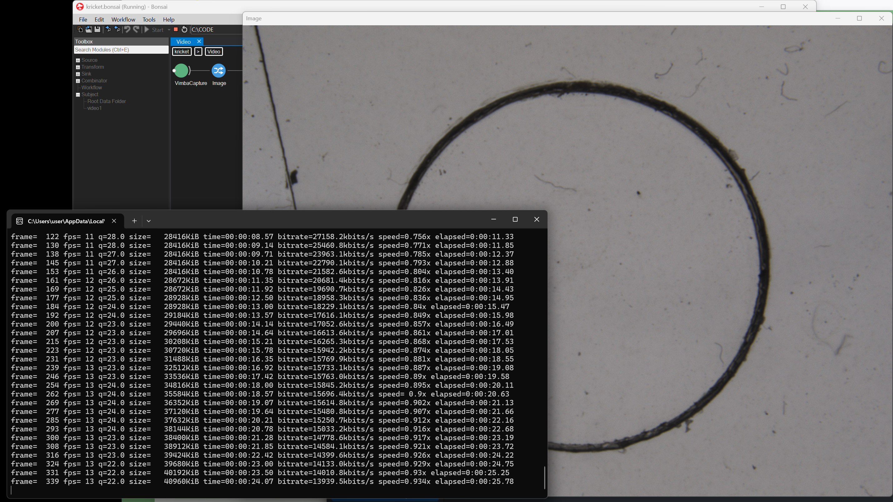

# Bonsai.VimbaX

A [Bonsai](https://bonsai-rx.org/) library for acquiring images from **Allied Vision**
cameras (Alvium series, e.g. **1800 U**) using the modern **Vimba X SDK** through the
managed **`VmbNET`** .NET API.

This is a port of the original [`bonsai-rx/vimba`](https://github.com/bonsai-rx/vimba)
package (`Bonsai.Vimba`, pinned to the legacy **Vimba SDK 5.1.0**) to **Vimba X**,
Allied Vision's current GenICam-compliant SDK. It has been **validated on real
hardware** (Alvium 1800 U-319c, RGB8 2064×1544) and produces a live image inside
Bonsai from a normal launch — no special shell, no SDK on `PATH`.

> **Platform:** Windows 10/11, 64-bit. (The codebase can target Linux too — see
> [Building for Linux](#building-for-linux-advanced) — but the instructions below
> and the shipped package are Windows x64.)

---




## Quick start (use the prebuilt package — no building)

If you just want to use the camera in Bonsai and not build anything:

1. **Install the Vimba X SDK** (required — see [Step 1](#step-1--install-the-vimba-x-sdk)).
2. Download **[`dist/Bonsai.VimbaX.<version>.nupkg`](dist/)** from this repository.
3. In Bonsai: **Tools → Manage Packages → gear icon → add a package source**
   pointing at the folder containing the `.nupkg` (see [Step 5](#step-5--install-the-package-into-bonsai)).
4. Install **Bonsai.VimbaX**, restart Bonsai, drop a **VimbaCapture** node.

The prebuilt package is fully self-contained: it bundles the native Vimba X core
(`VmbC.dll` and dependencies), so you do **not** need to put the SDK on `PATH`.
You still need the SDK **installed** (for the USB driver + GenTL transport layers).

Prefer to build it yourself? Follow the full guide below.

---

## Requirements

- **Windows 10/11 (64-bit)**
- **Vimba X SDK** (free, from Allied Vision) — provides the USB driver and GenTL
  transport layers. Required on every machine that talks to a camera.
- **Bonsai 2.8+** (tested on 2.9.0)
- For **building only:** **.NET 8 SDK** (the package itself targets .NET Framework
  4.7.2, which ships with Windows; .NET 8 is only used by the build tooling and the
  smoke test).

---

## Full installation guide (Windows)

### Step 1 — Install the Vimba X SDK

This is the foundation; do it first.

1. Download **Vimba X for Windows (64-bit)** from
   <https://www.alliedvision.com/en/products/software/vimba-x-sdk/> (free, no login).
2. Run the installer. Ensure the **USB Transport Layer** is selected (default).
3. **Sanity-check the camera before any code:** open **Vimba X Viewer** (installed
   with the SDK), plug in the camera, and confirm you see a **live image**.
   - Live image → SDK + driver + camera all good.
   - No image → fix the driver/cable here before continuing; it is not a Bonsai issue.

> The Vimba X SDK is **always required**, even when using the prebuilt package.
> The package bundles the native `VmbC.dll`, but the SDK provides the USB driver
> and the GenTL `.cti` transport layers that actually enumerate the camera.

### Step 2 — Install the .NET 8 SDK (building only)

Skip this if you are using the prebuilt package from `dist/`.

```powershell
winget install Microsoft.DotNet.SDK.8
```

Or download the **SDK x64** installer from
<https://dotnet.microsoft.com/download/dotnet/8.0>.

Verify in a **fresh** PowerShell window (so `PATH` refreshes):

```powershell
dotnet --version
# -> 8.x.xxx
```

### Step 3 — Clone the repository

```powershell
cd ~
git clone https://github.com/horsto/vimba.git
cd vimba
git checkout vimba-x-port
```

### Step 4 — (Optional but recommended) Run the smoke test

This proves the Vimba X API can talk to your camera **independently of Bonsai** —
the fastest way to isolate camera/SDK problems from plugin problems.

```powershell
dotnet run --project tools/VmbNETSmokeTest -c Release
```

Expected with the camera attached:

```
Found N camera(s).
  Id=DEV_... Serial=XXXXX Model=1800 U-319c ...
Opened 1800 U-319c (serial XXXXX).
First frame: 2064x1544 PixelFormat=RGB8 BufferSize=9560448 ...
Done. Received 31 frame(s).
```

- **Record the `PixelFormat`** — it must be one of the supported formats
  (`Mono8`, `BGR8`, `RGB8`, `BayerRG8`). Others throw until added to `GetConverter`.
- `Found 0 cameras` → SDK installed but camera not seen (close the Viewer first — it
  holds the camera open; recheck the cable).
- `NoTL` / "no transport layers" → Vimba X SDK not installed correctly.
- A benign `StreamBufferAlignment ... NotFound` log line may appear — ignore it.

### Step 5 — Build the package

```powershell
cd ~\vimba
dotnet build Bonsai.VimbaX\Bonsai.VimbaX.csproj -c Release
```

This produces the package at:

```
vimba\bin\Release\Bonsai.VimbaX.<version>.nupkg
```

(Roughly 1.4 MB — it bundles the native Vimba X libraries.)

### Step 6 — Install the package into Bonsai

1. Open **Bonsai**.
2. **Tools → Manage Packages**.
3. Click the **gear / settings** icon (top-right of the package manager).
4. Add a new package source:
   - **Name:** `Local VimbaX` (anything)
   - **Source:** the folder containing the `.nupkg`
     (e.g. `C:\Users\<you>\vimba\bin\Release`, or the repo's `dist` folder if using
     the prebuilt package)
   - Save.
5. Switch the **source dropdown** (top-left) to **Local VimbaX**.
6. Select **Bonsai.VimbaX** → **Install** → accept.
7. **Close and reopen Bonsai** so the new assemblies load cleanly.

> **Upgrading?** If a previous install failed or you are bumping versions, close
> Bonsai and remove stale package folders first:
> ```powershell
> Remove-Item "$env:LOCALAPPDATA\Bonsai\Packages\Bonsai.VimbaX.*" -Recurse -Force -ErrorAction SilentlyContinue
> ```

### Step 7 — Acquire images

1. Drop a **VimbaCapture** source into a workflow.
2. Click the **`SerialNumber`** dropdown and pick your camera's serial.
   (Camera simulators registered by the SDK also appear here — pick the real one.)
3. **Recommended:** set **`SettingsFile`** to a settings XML exported from the
   Vimba X Viewer (see below). This sets exposure/gain reproducibly.
4. Connect VimbaCapture to a display/visualizer sink and **Run**.

You should see a live image. **No PATH-patched shell and no SDK on `PATH` required.**

---

## Reproducible acquisition via a settings file (recommended)

Bonsai opens the camera with its power-up default exposure, which is often far too
short → a **black image**. The clean, version-controllable fix is to load a settings
XML exported from the Vimba X Viewer:

1. In **Vimba X Viewer**, open the camera and tune it until the live image looks right.
2. **Camera → Save Camera Settings** → save as e.g. `camera_settings.xml`.
3. Close the Viewer (it holds the camera in Full access mode).
4. In Bonsai, set **VimbaCapture → `SettingsFile`** to that XML path and **Run**.

The plugin loads the settings scoped to the **Camera (RemoteDevice)** module
(`ExposureTime`, `Gain`, `PixelFormat`, white balance, …). The Viewer saves an
"all modules" XML; loading it unscoped fails with `VmbErrorNotFound`, so the plugin
deliberately restores only the camera module.

---

## The `VimbaCapture` source

Emits a sequence of `VimbaDataFrame` (an OpenCV.Net `IplImage` plus `FrameID` and `Timestamp`).

| Property | Description |
|---|---|
| `Index` | Optional index of the camera to open (default 0). |
| `SerialNumber` | Optional camera serial number (dropdown lists connected cameras). |
| `FrameCount` | Optional number of frame buffers for continuous acquisition (0 = SDK default). |
| `SettingsFile` | Optional GenICam feature XML to load on open (scoped to the Camera module). |

Supported pixel formats (converted to `IplImage`): `Mono8`, `BGR8`, `RGB8`, `BayerRG8`.
Other formats throw — extend `GetConverter` in `VimbaCapture.cs` to add more.

---

## Troubleshooting

| Symptom | Cause / Fix |
|---|---|
| `Unable to load DLL 'VmbC'` (HRESULT 0x8007007E) | Native core not found. The prebuilt/Release package bundles it in `runtimes/win-x64/native`; if you see this, the install is incomplete — reinstall, or as a stopgap launch Bonsai from a shell with the SDK bin on `PATH`. |
| `Could not load file or assembly 'System.Reactive, Version=6.0.0.0'` | Package built against the wrong TFM. The project targets **net472** on purpose; do not change it to `netstandard2.0`. |
| `... 'GCBase_..._AVT.dll' ... expected to contain an assembly manifest` | Native DLLs ended up in `lib/`. They must live in `runtimes/win-x64/native`; the build already does this — rebuild from a clean checkout. |
| Black preview | Exposure too short. Load a Viewer settings XML via `SettingsFile`. |
| `... all the modules ... cannot be identified ... (NotFound)` | Settings loaded unscoped. Already handled in code by scoping to the Camera module — make sure you are on the current build. |
| Dropdown can't find camera but Viewer can | Close the Vimba X Viewer (it holds the camera). |
| `Found 0 cameras` in smoke test | SDK installed but camera not seen — check cable, close Viewer. |
| Package change not taking effect | Bump the package version and reinstall; Bonsai/NuGet cache packages by version. |

---

## Building for Linux (advanced)

The managed `VmbNET.dll` is identical across runtime packages; `VmbNetRid` selects
which native libraries are restored. Linux native packages exist but are **untested**
here, and the native-library packaging target currently emits `runtimes/win-x64/native`
only — a Linux build would need an analogous `runtimes/linux-x64/native` group.

```bash
dotnet build Bonsai.VimbaX/Bonsai.VimbaX.csproj -c Release -p:VmbNetRid=linux-x64
dotnet build Bonsai.VimbaX/Bonsai.VimbaX.csproj -c Release -p:VmbNetRid=linux-arm64
```

---

## How distribution works (for maintainers)

- **Prebuilt package** lives in [`dist/`](dist/) and is committed to the repo
  (the `.gitignore` has an explicit exception for it). Users can install it without
  building. Update it by copying the freshly built `bin/Release/Bonsai.VimbaX.<v>.nupkg`
  into `dist/` and bumping the version.
- **GitHub Releases** (recommended next step): attach the `.nupkg` to a tagged release
  for clean versioned downloads. Requires a GitHub token / the web UI; not done
  automatically here.

---

## License

MIT (see [LICENSE](LICENSE)). Original work © NeuroGEARS Ltd. Port by Horst Obenhaus.
